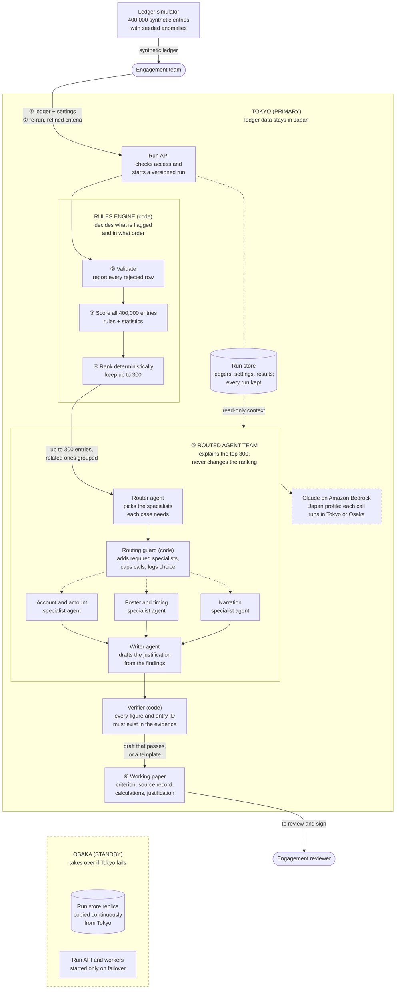

# Tickmark architecture: one batch run

How one engagement's ledger becomes a signed working paper. The circled numbers match the golden-path steps in [scope.md §2](../scope.md), and [entry-investigation.md](entry-investigation.md) zooms into step ⑤ for one entry. The decisions behind each part are in [adr.md](../adr.md).

- **Code decides, agents explain:** rules and statistics choose and rank the entries. The agents only investigate and justify the top 300, and never change the order.
- **Routing:** the router picks specialists for each case, and the guard always adds the one each flagged criterion requires. Dotted arrows run only when routed, and several specialists can work on one case at once; see [entry-investigation.md](entry-investigation.md).
- **Two regions:** Tokyo runs everything. Osaka keeps a replica of the run store, with the Run API and workers switched off; if Tokyo fails, Osaka takes over and each run resumes from its last checkpoint. Every model call runs in Tokyo or Osaka, so ledger data never leaves Japan (ADR-015, ADR-018).
- **⑦ Re-runs:** each one is a new versioned run. The same ledger and settings give the same ranking, and recorded routing decisions and agent outputs are reused rather than paid for again.
- **⑧ Limits:** under 4 hours per run, under USD 40 per engagement, 12 engagements at once in peak season.
- **Where the details live:** the orchestrator is a LangGraph graph built on LangChain (ADR-017). Every step ⑤ box is a node in it and code decides each branch. The routing guard is one of its code nodes and holds each case's model allowance, and each case file, with its evidence pack, lives in the run store. [entry-investigation.md](entry-investigation.md) shows both, using the same boxes as this diagram.
- **Not shown:** evaluation against the seeded anomalies, monitoring, and GitHub CI/CD.
