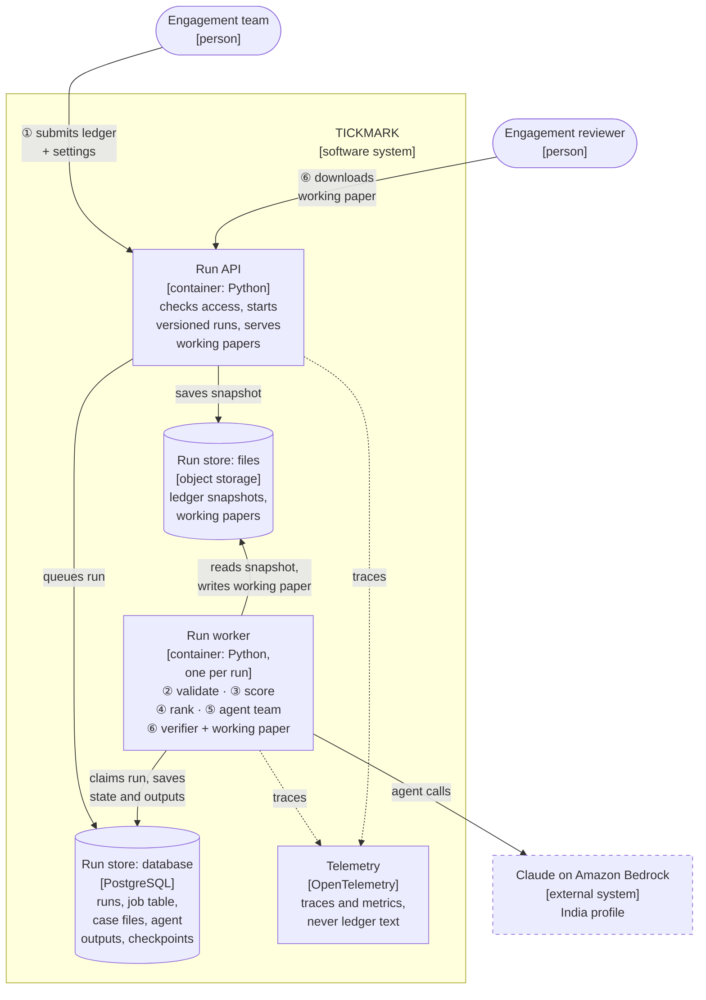

# Tickmark C4: containers

The separately running parts of Tickmark, and what each one stores or calls. This is level 2 of the C4 model, zooming into Tickmark from the [context](c4-context.md) view. [architecture.md](architecture.md) shows the same parts step by step, and [c4-deployment.md](c4-deployment.md) shows where they run.

- **Run worker:** one per run, started when a run is queued and stopped when it finishes. It holds the rules engine (DuckDB with versioned SQL criteria), the routed agent team (a LangGraph graph) and the verifier from [architecture.md](architecture.md) (ADR-016, ADR-017).
- **Run store:** the single "Run store" of [architecture.md](architecture.md) is two containers here: a database for state and object storage for ledgers and working papers.
- **Model calls** leave only from the worker, and only to Bedrock's India profile; agents have no other network access (ADR-013).
- **Local development** runs the same containers in Docker Compose, with Ollama models in place of Bedrock (ADR-021).
