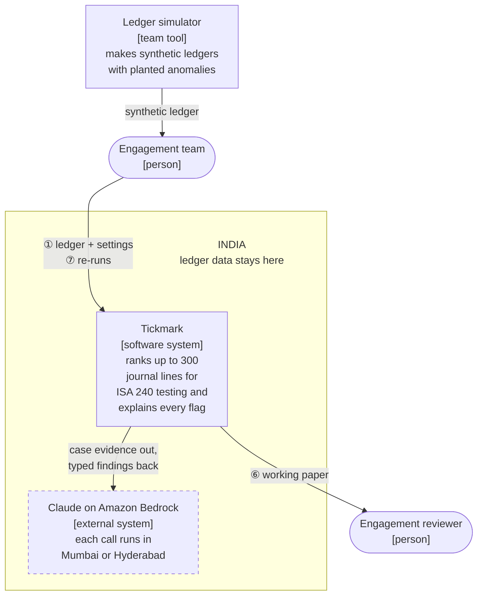

# Tickmark C4: system context

Who uses Tickmark and what it depends on. This is level 1 of the C4 model. The [containers](c4-containers.md) view zooms into Tickmark, and [architecture.md](architecture.md) shows one run step by step.

- **People:** the engagement team submits ledgers and re-runs them; the engagement reviewer signs the working paper. Neither talks to the AI model directly.
- **Claude on Amazon Bedrock** is the only outside system Tickmark calls while it runs. Its India profile keeps every call in Mumbai or Hyderabad (ADR-018).
- **Ledger simulator:** a team tool that feeds the demo and the evaluation. It is not part of the running system, and real client ledgers are out of scope (ADR-004).
- The circled numbers match the golden path in [scope.md §2](../scope.md).
