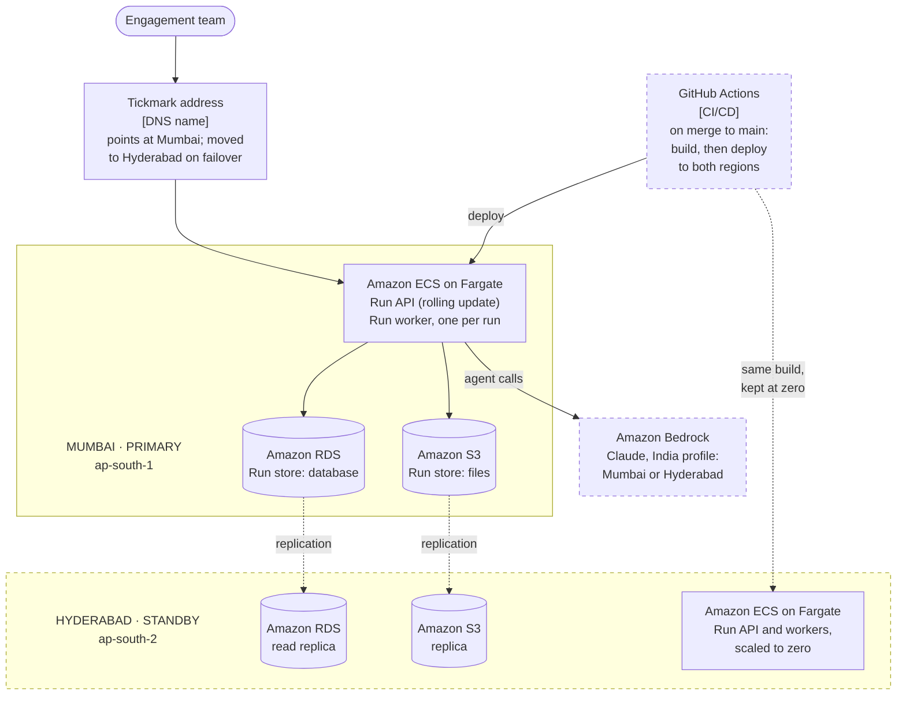

# Tickmark C4: cloud deployment

Where the [containers](c4-containers.md) run in the cloud: two AWS regions in India, Mumbai primary and Hyderabad standby (ADR-015). Every merge into `main` deploys here (ADR-019). The platform choices stay proposals until the load test confirms them (ADR-016).

- **Normal running:** everything runs in Mumbai. Hyderabad keeps replicas of the database and files, and its Run API and workers stay at zero until a failover (ADR-015, ADR-016).
- **Failover:** promote the Hyderabad database replica, start the Run API and workers there, and move the DNS name to Hyderabad. Hyderabad already has the latest build, so a failover needs no deploy, and each run resumes from its last checkpoint.
- **Deploys:** every merge into `main` goes to both regions. Mumbai runs the new build, and Hyderabad gets the same build with nothing running, so a failover never starts an older version. GitHub Actions builds the images once, stores them in Amazon ECR (replicated to Hyderabad) and deploys with a short-lived AWS role. The Run API switches over only after health checks pass, and running workers finish on their own build (ADR-019). While Hyderabad is in use after a failover, releases go to Hyderabad only.
- **Model calls** go to Bedrock's India profile, which picks Mumbai or Hyderabad for each call, so a model outage in one region needs no failover (ADR-018).
- **Not shown:** networking (VPC, subnets, load balancer, security groups), the container registry, the telemetry backend in Mumbai, and local development (ADR-021).
