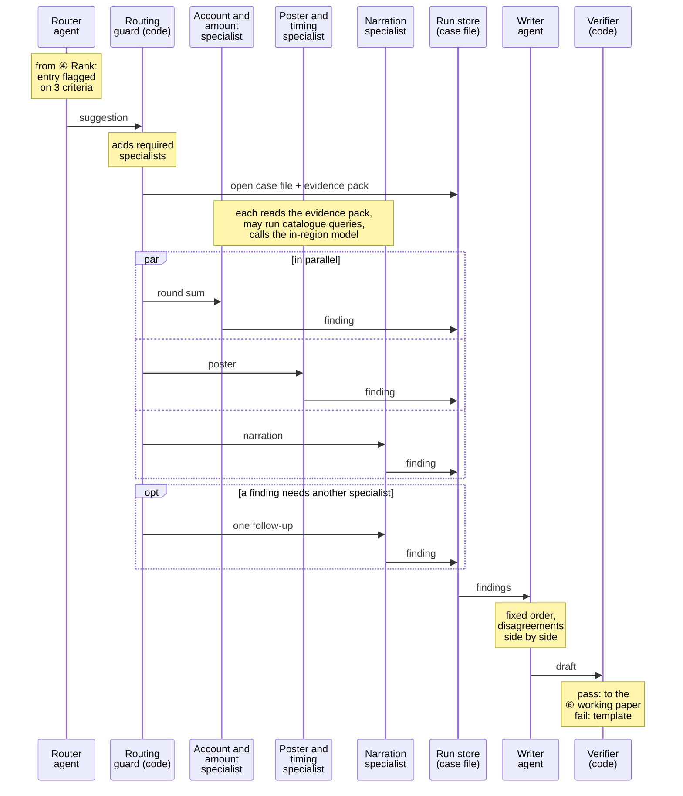

# Tickmark: investigating one flagged entry

Step ⑤ of the [architecture](architecture.md), using the same boxes, for one entry flagged on three criteria so that all three specialists are needed. The rules come from [scope.md §2](../scope.md), and the decisions behind them are ADR-007 to ADR-014 in [adr.md](../adr.md).

- **Same parts as the architecture:** the router suggests, the routing guard (a code node in the LangGraph orchestrator, ADR-017) dispatches, and every routing decision and finding is stored under a hash of its input and replayed on re-runs (ADR-010).
- **Shared case file:** code opens it with an evidence pack of the entry, criteria, calculations and standard read-only queries. Every specialist starts from that pack, may run a few typed catalogue queries (ADR-008), and writes a finding with evidence IDs. Specialists never talk to each other.
- **One follow-up at most:** if a finding needs another specialist's check, the routing guard sends one follow-up inside the case's model allowance. There is no open-ended agent conversation.
- **Disagreement is shown, not settled:** the writer puts conflicting findings side by side and marks the entry for the reviewer. No agent picks a winner, and the ranking doesn't change.
- **Related entries share a case:** reversal pairs, amounts split under an approval limit, and one user's entries in one period are grouped by code before routing, then investigated once.
- **Fixed allowance:** each case's model allowance covers its worst case (router, all three specialists, one follow-up and the writer) and is set before the run.
